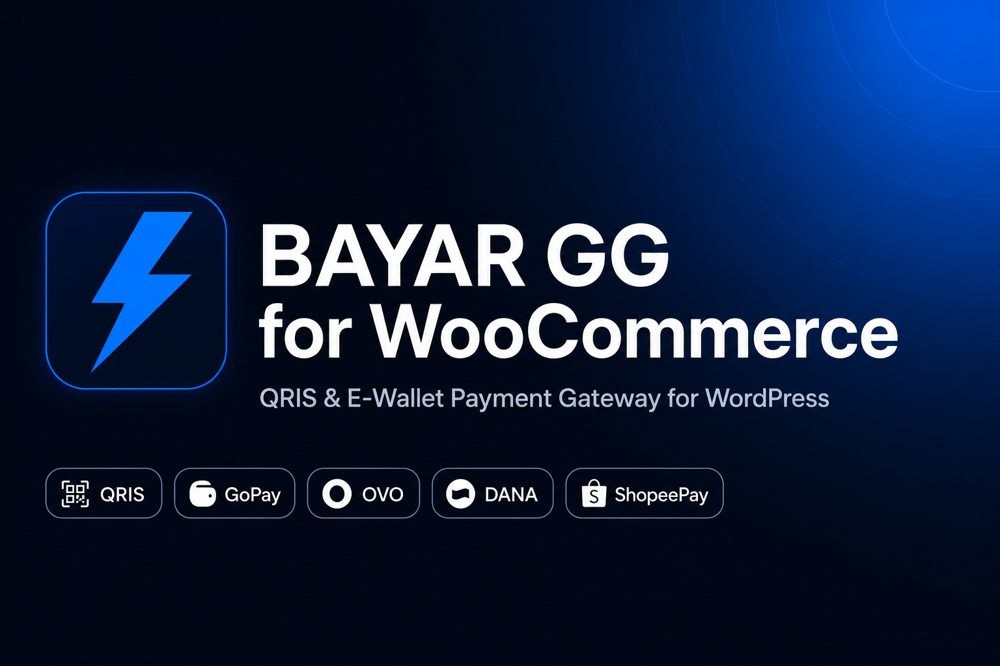

<p align="center">
  
</p>

<p align="center">
  <a href="https://www.bayar.gg"></a>
  
  
  
  
</p>

# BAYAR GG for WooCommerce

Plugin pembayaran resmi yang menghubungkan toko **WooCommerce** Anda dengan **BAYAR GG**. Pelanggan membayar lewat **QRIS** (satu QR bisa dipindai **semua e-wallet** dan mobile banking), lalu status order **otomatis lunas** lewat webhook.

> Butuh akun BAYAR GG + API Key — daftar/login di **https://www.bayar.gg**

---

## Daftar Isi

- [Fitur](#fitur)
- [Persyaratan](#persyaratan)
- [Cara Pasang](#cara-pasang)
  - [Cara 1 — Upload ZIP lewat wp-admin (paling mudah)](#cara-1--upload-zip-lewat-wp-admin-paling-mudah)
  - [Cara 2 — Manual via cPanel / FTP](#cara-2--manual-via-cpanel--ftp)
- [Konfigurasi (3 Menit)](#konfigurasi-3-menit)
- [Cara Mendapatkan API Key](#cara-mendapatkan-api-key)
- [Cara Kerja](#cara-kerja)
- [Uji Coba](#uji-coba)
- [Troubleshooting](#troubleshooting)
- [FAQ](#faq)
- [Dukungan](#dukungan)

---

## Fitur

- Satu metode **"QRIS / E-Wallet"** rapi di halaman checkout WooCommerce.
- Mendukung semua rail BAYAR GG: `QRIS Admin`, `QRIS BAYAR GG`, `BRI Merchant QRIS`, `Livin Merchant QRIS`, `GoPay Merchant QRIS`, `OVO`.
- **Konfirmasi otomatis** via webhook + **verifikasi ulang ke API** (anti-spoof) sebelum order ditandai lunas.
- **Jaring pengaman**: status dicek lagi saat pelanggan kembali ke halaman "Terima kasih".
- Kompatibel **WooCommerce HPOS** (High-Performance Order Storage) & checkout blocks.
- **Mode debug** dengan log bawaan WooCommerce.

---

## Persyaratan

| Komponen | Minimal |
| --- | --- |
| WordPress | 5.6+ |
| WooCommerce | 5.0+ |
| PHP | 7.4+ |
| Akun BAYAR GG | API Key aktif |

---

## Cara Pasang

### Cara 1 — Upload ZIP lewat wp-admin (paling mudah)

1. **Unduh plugin**: di halaman GitHub ini klik tombol hijau **`Code`** → **`Download ZIP`**.
2. Masuk ke **WordPress Admin** → menu **Plugins** → **Add New** → **Upload Plugin**.
3. Klik **Choose File**, pilih file ZIP tadi, lalu **Install Now**.
4. Setelah selesai, klik **Activate Plugin**.

> Catatan: ZIP dari GitHub berisi folder `bayargg-woocommerce-main`. Ini normal dan tetap berfungsi. (Opsional: rename folder menjadi `bayargg-woocommerce` bila ingin rapi.)

### Cara 2 — Manual via cPanel / FTP

1. Unduh & ekstrak ZIP plugin di komputer Anda.
2. Upload folder plugin ke: `wp-content/plugins/bayargg-woocommerce/`
   sehingga file utama berada di `wp-content/plugins/bayargg-woocommerce/bayargg-woocommerce.php`.
3. Buka **WordPress Admin** → **Plugins** → cari **BAYAR GG for WooCommerce** → **Activate**.

---

## Konfigurasi (3 Menit)

1. Buka **WooCommerce** → **Settings** → tab **Payments**.
2. Cari **BAYAR GG**, klik **Manage** / **Set up**.
3. Isi pengaturan:

| Pengaturan | Keterangan |
| --- | --- |
| **Aktifkan** | Centang untuk menyalakan metode pembayaran. |
| **Judul** | Teks yang dilihat pelanggan, mis. `QRIS / E-Wallet (BAYAR GG)`. |
| **Deskripsi** | Keterangan singkat di bawah judul. |
| **API Key** | Tempel API Key dari Dashboard BAYAR GG (wajib). |
| **API Base URL** | Biarkan `https://www.bayar.gg/api`. |
| **Metode Pembayaran** | Pilih rail yang **aktif** di akun Anda (lihat tabel di bawah). |
| **Webhook/Callback URL** | Otomatis — **tidak perlu** di-set manual. |
| **Mode Debug** | Nyalakan saat troubleshooting. |

4. Klik **Save changes**. Selesai!

**Pilih Metode Pembayaran:**

| Pilihan | Kapan dipakai |
| --- | --- |
| **QRIS Admin** | Paling universal. Maksimal **Rp 500.000**/transaksi. Cocok untuk mulai cepat. |
| **QRIS BAYAR GG** | QRIS dinamis per‑merchant (mID sendiri) — perlu fitur aktif di akun. |
| **BRI / Livin / GoPay Merchant QRIS** | Dana langsung ke rekening/akun merchant Anda — perlu akun terhubung. |
| **OVO** | Pembayaran via OVO — perlu akun OVO terhubung. |

---

## Cara Mendapatkan API Key

1. Login ke **https://www.bayar.gg/dashboard**.
2. Buka menu **API** / **Pengaturan**.
3. Salin **API Key** Anda (jaga kerahasiaannya — jangan dibagikan).
4. Tempel di kolom **API Key** plugin.

---

## Cara Kerja

```
Pelanggan checkout
        │
        ▼
Plugin → POST /api/create-payment.php  (kirim amount, data pelanggan, callback_url, redirect_url)
        │
        ▼
Pelanggan diarahkan ke halaman QRIS BAYAR GG  → scan & bayar
        │
        ▼
BAYAR GG kirim webhook ke toko Anda  →  plugin verifikasi ulang ke /api/check-payment.php
        │
        ▼
Status = paid  →  Order WooCommerce otomatis "Processing/Completed"
```

Plugin **tidak mempercayai** isi webhook mentah — ia selalu memverifikasi status langsung ke API BAYAR GG sebelum menandai order lunas.

---

## Uji Coba

1. Buat produk murah (mis. Rp 1.000–10.000) untuk tes.
2. Lakukan checkout memakai **QRIS / E-Wallet (BAYAR GG)**.
3. Anda akan diarahkan ke halaman pembayaran QRIS — bayar memakai e-wallet/mobile banking.
4. Setelah bayar, order otomatis menjadi lunas dan Anda diarahkan kembali ke halaman "Terima kasih".

---

## Troubleshooting

| Masalah | Solusi |
| --- | --- |
| Checkout gagal "Gagal memproses pembayaran" | Pastikan **API Key** benar dan **Metode Pembayaran** yang dipilih **aktif** di akun BAYAR GG. |
| Order tidak otomatis lunas | Nyalakan **Mode Debug**, lalu cek **WooCommerce → Status → Logs** (source: `bayargg`). |
| "Maksimal nominal Rp 500.000" | Anda memakai **QRIS Admin**. Ganti ke QRIS BAYAR GG/BRI/Livin/GoPay untuk nominal lebih besar. |
| Metode tidak muncul di checkout | Pastikan plugin **aktif**, opsi **Aktifkan** dicentang, dan **Save changes** sudah diklik. |

---

## FAQ

**Perlu setting webhook manual di sisi BAYAR GG?**
Tidak. Plugin mengirim `callback_url` otomatis di setiap transaksi.

**Apakah aman?**
Ya. Status pembayaran selalu diverifikasi ulang ke API BAYAR GG (tidak hanya percaya webhook), dan API Key hanya dipakai di sisi server.

**Mendukung HPOS WooCommerce?**
Ya, plugin sudah declare kompatibel dengan custom order tables (HPOS).

---

## Dukungan

- **Website:** https://www.bayar.gg
- **API Docs:** https://www.bayar.gg/api-docs
- **Dashboard:** https://www.bayar.gg/dashboard
- **Email:** support@bayar.gg

© BAYAR GG (PT BAYAR GLOBAL GATEWAY). Lisensi: GPL-2.0-or-later.
